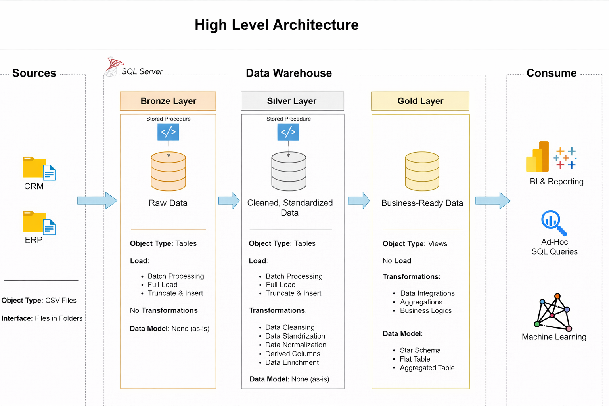

# 📊 Data Warehouse and Analytics Project

Welcome to the **Data Warehouse and Analytics Project** repository! 🚀  

This project demonstrates a **comprehensive end-to-end data warehousing and analytics solution**, covering everything from building a modern data warehouse to generating actionable business insights.  
It is designed as a **portfolio project** and follows **industry best practices** in data engineering and analytics.

---

## 🏛️ Data Architecture

The data architecture for this project follows the **Medallion Architecture** pattern, consisting of **Bronze**, **Silver**, and **Gold** layers.

### High-Level Architecture

---

## 🥉 Bronze Layer
- Stores **raw data** as-is from the source systems  
- Data is ingested from **CSV files** into **SQL Server**
- No transformations are applied

## 🥈 Silver Layer
- Performs **data cleansing**, **standardization**, and **normalization**
- Prepares data for analytical use
- Handles:
  - Data quality fixes  
  - Derived columns  
  - Enrichment logic  

## 🥇 Gold Layer
- Contains **business-ready data**
- Modeled using a **Star Schema**
- Optimized for:
  - Reporting  
  - Dashboards  
  - Analytics  
  - Machine Learning  

## 🚀 Project Requirements

### 🏗️ Building the Data Warehouse (Data Engineering)

#### 🎯 Objective
Develop a **modern data warehouse using SQL Server** to consolidate sales data, enabling analytical reporting and informed decision-making.

---

#### 📌 Specifications

- **📂 Data Sources**  
  Import data from **two source systems** (ERP and CRM) provided as CSV files.

- **🧹 Data Quality**  
  Cleanse data and resolve data quality issues before analysis.

- **🔗 Integration**  
  Combine both source systems into a **single, user-friendly analytical data model**.

- **📅 Scope**  
  Focus on the **latest dataset only**.  
  Historical data tracking is **not required**.

- **📝 Documentation**  
  Provide clear documentation of the data model to support:
  - Business stakeholders  
  - Analytics teams  

---

## 📈 BI: Analytics & Reporting (Data Analytics)

### 🎯 Objective
Develop **SQL-based analytics** to deliver detailed insights into:

- **👥 Customer Behavior**
- **📦 Product Performance**
- **📊 Sales Trends**

These insights help stakeholders track **key business metrics** and support **strategic decision-making**.

---

## 🛡️ License

This project is licensed under the **MIT License**.  

You are free to:
- Use  
- Modify  
- Share  

With proper attribution.  
See the [MIT License](LICENSE) for more details.

---

## 🌟 About Me

Hi! 👋  
I’m Tazwar a  data enthusiast passionate about **data engineering, analytics, and building scalable data platforms**.  
This project reflects my hands-on learning and practical understanding of modern data warehousing concepts.

Feel free to explore, fork, or reach out!
